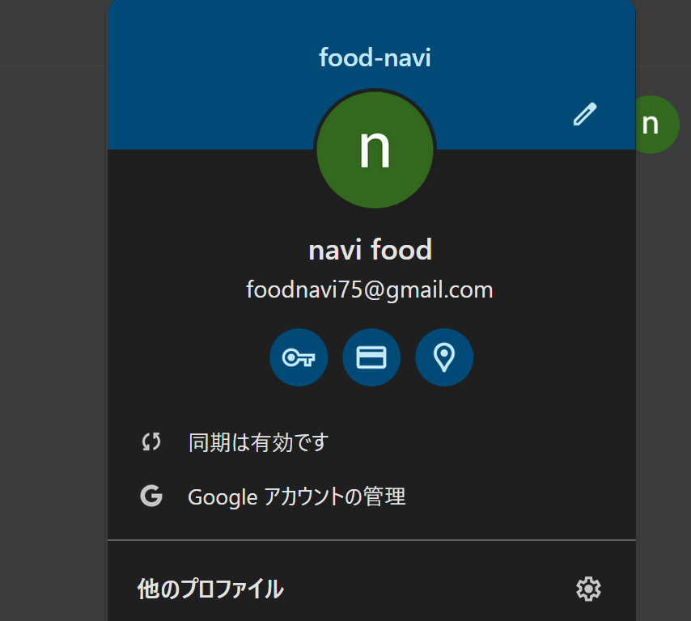
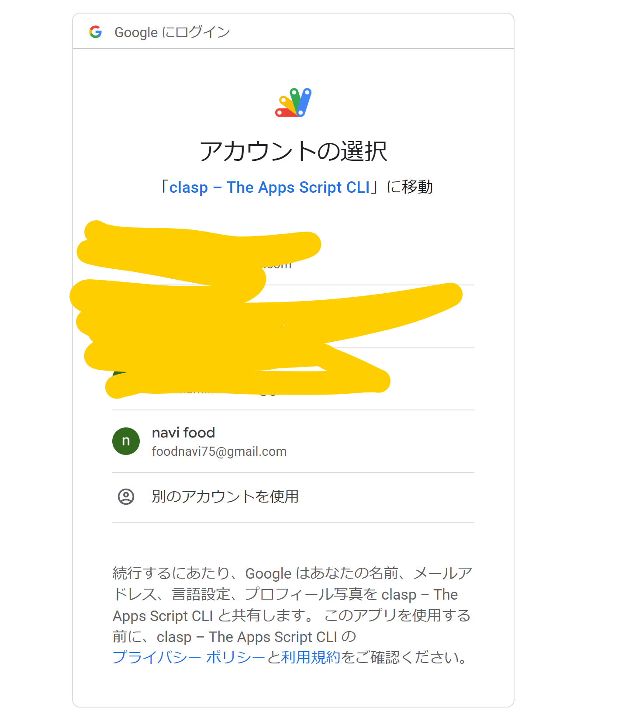

# 環境構築手順

## リポジトリのクローン

リポジトリをクローンしたあと`npm install`する。

## Googleアカウントのログイン

共用アカウントにログインする。

## 共用アカウントの認証

### Googleアカウントの切り替え

1. **アカウントへのログイン**: プロジェクトに使用したいアカウントで`clasp login`コマンドを使ってログインします。このとき起動するブラウザが共用アカウントのプロファイルになっていることを確認します。
   

   ```bash
   clasp login
   ```

   このプロセスを通じて、ブラウザが開き、Googleアカウントの認証を求められます。
   ここで、Googleアカウントの認証を行ってください。
   

## .clasp.jsonと.clasp-dev.jsonの設定

取得後`.clasp.json`と`.clasp-dev.json`を作成する。
`scriptId`と`parentId`はSlackで連携したものを入力する。
ファイルの中身は両方とも同じ内容を入力する。

```json .clasp.json
{
  "scriptId": "xxxxxxxxxxxxxxxxx",
  "rootDir": "./dist",
  "parentId": ["xxxxxxxxxxxxxxxxx"]
}
```

## ビルド

`npm run build`で`dist`配下にソースが突っ込まれればOK、

## デプロイ

`npm run deploy`をすればGoogle Accountに紐づいたGASのプロジェクトへビルドされる。
ビルド後に`https://script.google.com/home`へアクセスし`food-navi`を選択後、ソースが反映されていれば環境構築終了。
